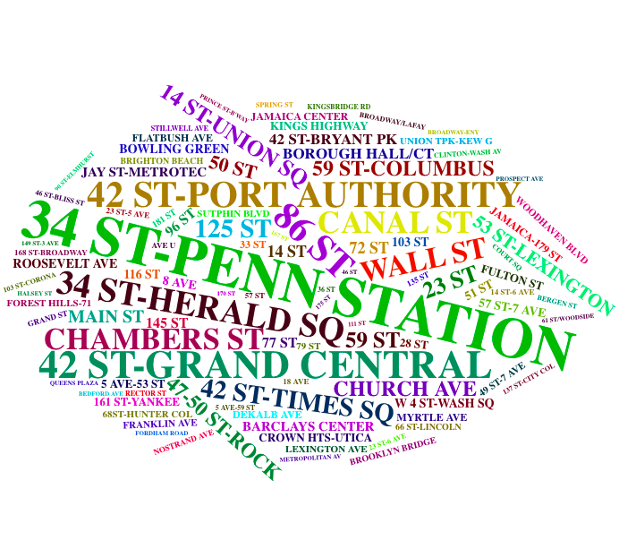

# Ride Or Drive?
Considering the importance of transportation in a metropolitan area as big as New York City, our team was interested in analyzing any trends, patterns and insights in transit choices. More specifically, we were interested in examining the factors that people consider when selecting a mode of transportation.

According to the MTA, annual subway ridership spiked at 1.7 billion riders in 2015. This is the highest number of riders since 1948. With 5.7 million riders per weekday, the MTA carries the greatest number of commuters compared to any other transit system in the Western Hemisphere.

The rise of Uber and other ride-sharing platforms can be understood as competitors to the MTA. They offer a more personalized transit experience and greater convenience than a yellow or green taxi. Throughout the 2010s, Uber and its counterparts have grown to represent a great portion of New York City’s transit options.

Our group is interested in comparing these two forms of transit, MTA subway ridership and Uber rides. Fortunately, enough overlapping data allows us to examine transit patterns from a few difference angles. MTA data comes from NYC Open Data in a readily accessible format. Uber data, on the hand, was acquired from a FOIA request by fivethirtyeight. Finally, weather data gathered from the National Weather Service helped examine ridership trends between the two transit choices.

In total, we identify transit patterns from April 2014 to September 2014. Overall, we look for patterns across days of the week, the impact that precipitation has on MTA & Uber ridership, transit use and neighborhood income levels, and transit elasticity. We also thought it would be cool to take a closer look at what stations have the most traffic-by looking at both entry and exit swipes.

This wordcloud gives a brief impression of which stops are the most popular. The sizes of names of stations correspond with the entry traffic they receive, though this sort of representation would look almost identical if it were representing exit traffic. Clearly, the major transit hubs loom large-- Penn Station, Grand Central Station, Port Authority Bus Terminal, Times Square. But we also see popularity around job centers: Chambers Street and Wall Street downtown, or Rockefeller Center in Midtown. Of course, many are also commuting from outerboroughs, which perhaps explains the relative popularity of stations like Borough Hall, Church Avenue, or Kings Highway, all in Brooklyn.

We've got lots more to say on that note-- please check out our project [here](https://thisisnotaprogrammer.shinyapps.io/shiny_app/).
